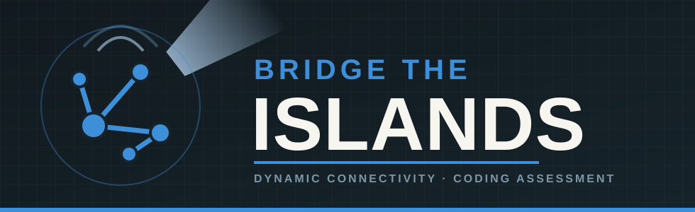

<p align="center">
  
</p>

# Bridge the Islands — starter project

An archipelago just landed on your desk — a scatter of islands, none of
them talking to each other yet. Over time, engineers report back:
another bridge finished here, another there, no particular order, no
warning. And every so often, someone leans over your shoulder and asks
the only question that matters: *can I actually get from this island to
that one right now?*

They're going to ask that a lot. Thousands of times, maybe. You don't get
to stop and redraw the whole map each time someone asks — you need an
answer, right now, every time.

This repo is where you build the answer, in Python or Java, whichever
you're happier in. Both are graded the same way, so pick on comfort, not
on which one you think looks better.

## The problem

You're given `n` islands, numbered `0` to `n-1`, starting out completely
disconnected from one another. Then you're given a list of `events`, in
order, each one of two kinds:

- `U u v` — a bridge is built between island `u` and island `v`. Bridges
  are permanent; once built, they're never removed.
- `Q u v` — a query: right now, at this exact point in the sequence, can
  you travel from island `u` to island `v` using any sequence of bridges
  built so far?

**Your job:**

```
count_reachable_queries(n, events) -> int
```

Process every event in order, and return how many of the `Q` events were
answered "yes."

### Worked example

```
n = 8
events:
  U 0 1
  U 1 2
  Q 0 2      <- yes: 0 and 2 are joined through 1
  U 2 3
  U 3 4
  Q 0 4      <- yes: the chain now reaches all the way to 4
  U 4 5
  U 5 6
  U 6 7
  Q 0 7      <- yes: one long chain, 0 through 7
  Q 1 6      <- yes: same chain, different pair
```

- Answer → `4`

Every query in this example is a "yes" — but notice that 0 and 2 are
never bridged directly, and neither are 1 and 6. The only bridges that
ever get built are between *consecutive* islands. Whether two islands
can reach each other depends on the whole chain of bridges between them,
not on whether they happen to share one directly.

Want a slower, more thorough walk through this and one more example,
staged event by event? See [EXAMPLE.md](EXAMPLE.md).

### Constraints

Nothing sneaky here — just the numbers to design around:

- `1 ≤ n ≤ 100,000`
- `1 ≤ number of events ≤ 200,000`
- for a `U` event, `0 ≤ u, v < n` and `u ≠ v`
- for a `Q` event, `0 ≤ u, v < n` (`u` and `v` may be equal — an island
  can always reach itself)

## Layout

```
bridge-the-islands-starter/
  test_data/
    simple/    <- 8 tiny, hand-traceable event sequences
    medium/    <- 5 bigger hand-designed cases, still traceable on paper
    hard/      <- 6 generated cases — too large to solve by hand
  python/
    bridge_islands.py    <- implement your solution here
    test_data.py           loads cases from ../test_data
    main.py                 a small demo runner (prints one example)
    run_tests.py             the test harness — every case, PASS/FAIL, timing, an efficiency band
    scripts/
      compile.sh             syntax-checks the Python files
      run.sh                  runs main.py
      test.sh                 runs run_tests.py
  java/
    src/
      BridgeIslands.java    <- implement your solution here
      TestData.java           loads cases from ../test_data
      Main.java                a small demo runner (prints one example)
      TestRunner.java           the test harness — every case, PASS/FAIL, timing, an efficiency band
    scripts/
      compile.sh             javac's everything into java/build
      run.sh                  compiles, then runs Main
      test.sh                 compiles, then runs TestRunner
```

You only need to touch `bridge_islands.py` / `BridgeIslands.java` —
everything else is scaffolding that's already wired up and ready to go:
the test data, the demo runner, the test harness, the shell scripts.

Each solution file has a couple of empty helper methods already sketched
in (splitting an event line into its parts, checking an island index is
in range). Use them, rename them, rip them out entirely — whatever gets
you to a solution you're happy with. They're there to save you some
typing, not to tell you how to think about the problem.

## Test data tiers

- **Simple** (`test_data/simple/`) — a handful of islands and events,
  small enough to check your basic bridge/query logic just by looking
  at it.
- **Medium** (`test_data/medium/`) — still small enough to trace on
  paper if you want to sanity-check an answer, but it takes real
  attention — several cases are built specifically around chains,
  repeats, and orderings that are easy to get subtly wrong.
- **Hard** (`test_data/hard/`) — nobody's tracing these by hand. Tens of
  thousands of islands, tens of thousands of events. Some are plain
  large; a few are shaped deliberately to punish an approach that has to
  work harder and harder as the map grows, even though the map itself
  never gets *that* big. If a run hangs or drags on the `hard` tier,
  that's worth digging into — the data isn't broken, your approach
  probably needs a rethink.

## Quick start

Python (needs Python 3.8+, no other dependencies):

```bash
cd python
./scripts/test.sh     # run the test suite
./scripts/run.sh       # run the demo on one example case
```

Java (needs a JDK on your PATH, no build tool required):

```bash
cd java
./scripts/test.sh     # compiles, then runs the test suite
./scripts/run.sh       # compiles, then runs the demo on one example case
```

## Definition of done

`./scripts/test.sh` should print `TOTAL: 19 passed, 0 failed` in both
languages, ending with `Efficiency band: Efficient (< 2s total)`. Right
now every test fails with `NOT IMPLEMENTED` — that's your starting line,
not a bug.

That last line is reading the `hard` tier's total time: `Efficient` under
2 seconds, `Adequate` up to 10, `Slow` beyond that. A correct, reasonably
efficient solution should land comfortably in `Efficient`. If you're
seeing `Adequate` or `Slow`, or the hard tier just never finishes, take
that seriously — it's telling you something real about your approach, not
just filling space at the bottom of the output.

Good luck. Someone's always about to ask if two islands are connected.
